# Il manoscritto Voynich, messo alla prova

Questa cartella non c'entra col sito dei parlamentari: è un lavoro a parte sul
manoscritto Voynich (Beinecke MS 408), un codice su pergamena datata al
radiocarbonio fra il 1404 e il 1438, scritto in un alfabeto che nessuno ha
mai letto.

**Qui non c'è una decifrazione.** Ci sono ventotto esperimenti ripetibili, in
cinque tornate. La prima mette alla prova un'idea precisa: che il testo non sia una
lingua scritta con un alfabeto normale, ma qualcosa di "tokenizzato", cioè fatto
di unità più grandi delle lettere (gruppi di segni per una lettera, codici per
una parola, sillabe). La seconda allarga le analisi e tenta una decifrazione vera,
con i controlli che servono a non illudersi. La terza costruisce un risolutore
capace di leggere un testo cifrato anche senza spazi, lo prova su testi di cui
si conosce la risposta e poi lo usa sul Voynich: in 71 lingue, contando i segni
in molti modi diversi. Prova anche l'idea che le parole siano anagrammi. La
quarta è un giro di sondaggi veloci sulle strade rimaste aperte, e finisce con
l'algoritmo completo di Timm e Schinner, un testo senza messaggio che rifà gran
parte del Voynich; con una regola in più, sulle giunture fra parole, ne rifà quasi
tutto, tranne la varietà del vocabolario. Preghiere e litanie, invece, non gli
somigliano. La quinta rifà due decifrazioni pubblicate con il controllo che
mancava, un testo senza messaggio: lo leggono allo stesso modo. Poi cerca i nomi delle
piante nelle pagine dell'erbario, senza trovarli, e guarda se le parole uniche che mancano
al generatore possano essere errori di scrittura o di lettura: in parte sì. Ogni numero si
rifà con i comandi in fondo alla pagina.

## In breve

**1. La lettera successiva è davvero troppo prevedibile per un alfabeto normale,
ma quanto dipende da come si contano i segni.** Nel testo del Voynich, sapere un
segno aiuta a indovinare il successivo più che in qualsiasi lingua del campione,
la Bibbia in circa 100 lingue. Nell'alfabeto EVA, anche fondendo i segni
composti, l'incertezza sul segno successivo (h2) è 2,2 bit. Le lingue con un
alfabeto di taglia simile stanno fra 2,6 e 3,3: il latino a 3,3, l'italiano a 3,2,
i testi tecnici latini fra 3,2 e 3,4. Il Voynich resta fuori anche togliendo gli
spazi (2,5 contro 2,9–3,5), e fra una porzione di testo e l'altra i numeri ballano
appena 0,01–0,03 bit.

Con la trascrizione di Glen Claston (alfabeto v101), che conta come un segno solo
alcuni gruppi che l'EVA spezza (per esempio le serie di *i* in *aiin*), il
distacco si riduce. Con gli spazi siamo a 2,5 contro 2,8–3,3, ancora fuori; solo
il maori arriva a 2,5, ma con un alfabeto di 15 lettere. Senza spazi siamo a 2,9
contro 2,8–3,6, cioè al margine basso delle lingue. Quindi due cose:
- una parte della prevedibilità dipende da come si tagliano i segni. È proprio
  l'idea "tokenizzata": le unità vere sono più grandi delle lettere EVA;
- un'altra parte viene dai confini di parola, perché le parole del Voynich
  cominciano e finiscono con pochissimi segni.

Una sostituzione semplice (una lettera, un segno) non cambia questi numeri, né con
gli spazi né senza: per le lingue del campione è esclusa.

<picture>
  <source media="(prefers-color-scheme: dark)" srcset="risultati/e01_prevedibilita-scuro.png">
  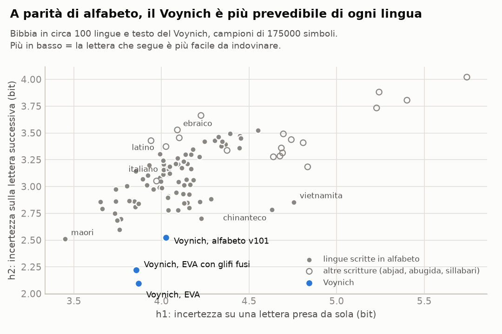
</picture>

**2. Il cifrario "verboso" non ci arriva.** L'idea più semplice di testo
tokenizzato è che ogni lettera sia scritta con due o tre segni: così il testo
diventa più prevedibile. Ma diventa anche più lungo. Su 450 cifrari di questo
tipo applicati a latino e italiano, nessuno arriva alla prevedibilità del
Voynich, e quelli che ci vanno più vicino (h2 fra 2,4 e 2,5) hanno parole di
8–10 segni, il doppio delle sue (4,5). Perché un cifrario del genere producesse
le parole del Voynich, il testo in chiaro dovrebbe avere parole di due lettere in
media.

<picture>
  <source media="(prefers-color-scheme: dark)" srcset="risultati/e07_compromesso_verboso-scuro.png">
  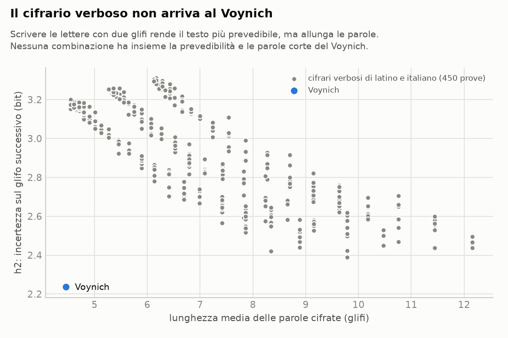
</picture>

**3. Le parole del Voynich non si comportano come parole cifrate di un testo
vero.** C'è un modo di cifrare che riproduce benissimo le lettere del Voynich:
sostituire ogni parola di un testo latino con una parola del Voynich di pari
frequenza. Le lettere diventano quelle del Voynich, e il vocabolario è vario
quanto quello di una lingua, come nel Voynich. Eppure il risultato non somiglia
al Voynich, per due motivi. Nessuna delle codifiche provate li riproduce insieme:

- **le lingue evitano di ripetere subito la stessa parola, il Voynich no.** Nel
  Voynich una parola è identica alla precedente tanto spesso quanto due parole
  qualsiasi della stessa riga (×1,0). Nelle lingue la grammatica lo impedisce
  quasi sempre: su 95 testi naturali la mediana è ×0,12. Fa eccezione solo
  l'indonesiano, che forma il plurale raddoppiando la parola (*orang-orang*).
  Qualsiasi codice che trasformi ogni parola sempre nello stesso modo conserva
  questa proprietà, e infatti tutte le codifiche restano fra ×0,1 e ×0,5. Non
  dipende da parole brevissime: le ripetute sono parole piene come *chol*,
  *qokeedy*, *daiin*;
- **le parole della stessa pagina si somigliano nella grafia.** Due parole diverse
  della stessa riga, o di righe vicine, si somigliano il 4% più di due parole
  qualsiasi del testo. Nei testi naturali si va da −0,4% a 1,5%, e il massimo
  viene dalle lingue bantu (zulu, xhosa), dove le parole di una frase concordano
  nel prefisso. Circa quattro quinti dell'effetto vengono dalla pagina intera, il
  resto dalle righe più vicine.
  Tiene con due trascrizioni, dentro la lingua A e dentro la lingua B di Currier, e
  anche fondendo i segni che i trascrittori confondono più spesso. Un codice in cui
  lo scriba cambia abitudini di scrittura a ogni pagina (*ch* al posto di *sh*,
  *q* in testa...) riproduce questa omogeneità, anche troppo. Ma allora la
  somiglianza è la stessa a qualsiasi distanza fra le righe, mentre nel Voynich
  cala. Il vocabolario diventa più vario di quello del Voynich e le ripetizioni
  immediate restano evitate.

<picture>
  <source media="(prefers-color-scheme: dark)" srcset="risultati/e09_sintesi-scuro.png">
  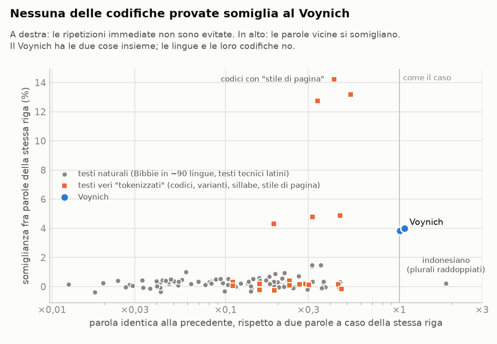
</picture>

**4. Due cose che sembravano anomalie e non lo sono.** Confrontato con la Bibbia,
il Voynich sembrava avere pochissima sintassi (una parola dice poco sulla
successiva). Ma i testi tecnici latini ne hanno altrettanto poca: era la Bibbia a
essere un confronto sbagliato, perché è molto formulaica. E la "copiatura" fra
parole adiacenti di cui parlano alcuni studi, a guardarla bene, non riguarda le
parole adiacenti: riguarda la pagina.

**5. Una cosa che non ha funzionato.** Abbiamo provato a generare un testo che si
copia da solo, sul modello proposto da Timm e Schinner (2020): chi scrive ricopia
una parola delle righe sopra e la ritocca. La nostra versione semplificata non
riesce a riprodurre il vocabolario del Voynich e dopo molte copie degenera in
parole troppo corte. Non è una prova né a favore né contro quell'ipotesi.

<picture>
  <source media="(prefers-color-scheme: dark)" srcset="risultati/e05_righe-scuro.png">
  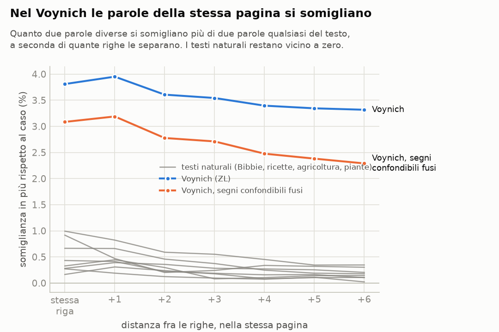
</picture>

## Seconda tornata: altre analisi e un tentativo di decifrazione

**6. Il cifrario Naibbe, la migliore proposta attuale, non riproduce il Voynich.**
Nel 2025 Michael Greshko ha pubblicato un cifrario quattrocentesco, fatto a mano con
un mazzo di carte, che trasforma latino e italiano in qualcosa di molto simile al
Voynich: il testo si taglia in pezzi di una o due lettere e ogni pezzo diventa una
"parola", presa da una di sei tabelle. Abbiamo usato il Plinio cifrato da lui e,
con le sue tabelle, abbiamo cifrato Vitruvio e la Bibbia latina e italiana, anche
in una variante in cui le preferenze fra le tabelle cambiano da una pagina
all'altra.
- **Dove somiglia al Voynich:** prevedibilità della lettera (2,2), lunghezza e
  varietà delle parole.
- **Dove no:**
  - parole usate una volta sola: 0,37–0,44 contro 0,68;
  - ripetizioni immediate: ×0,33–0,69 contro ×1,0;
  - omogeneità di pagina: al massimo 2,2%, e piatta, contro il 3,8–4,0% che cala
    con la distanza;
  - legame fra la fine di una parola e l'inizio della successiva: 0,002–0,013
    bit contro 0,19. È meno di qualsiasi lingua.

**7. Gli spazi sono in parte regole di scrittura, in parte facoltativi.** Nel Voynich
lo spazio si prevede per due terzi dal segno che lo precede (66%, contro una mediana
del 17% nelle lingue): certe forme stanno solo a fine parola. E se si uniscono due
parole vicine, nel 9,2% dei casi si ottiene una parola che il manoscritto usa
altrove (4,8% unendo parole a caso; nelle lingue lo 0,1–0,7%). Le parole del
Voynich sono fatte di pezzi che si attaccano e si staccano.
- **Spazi incerti e certi:** fra gli spazi che i trascrittori hanno segnato come
  incerti l'unione torna nel 43,5% dei casi (31% per caso, perché spesso separano
  frammenti brevissimi); fra quelli certi nel 6,1% (3,4% per caso).
- **Giunture morbide:** prima delle parolette in *a* (*aiin*, *ar*, *al*) e dopo
  *o*, l'unione è attestata nel 40–56% dei casi (*s aiin* → *saiin*, *ol chedy* →
  *olchedy*).
- **Giunture dure:** prima di *q* e dopo *m* non lo è quasi mai (0–1%).

Rifare il testo senza gli spazi dubbi non lo avvicina a una lingua.

**8. Tutto considerato, il Voynich non somiglia a nessuna lingua.** Sulle singole
misure a volte sfiora le lingue austronesiane: maori e malgascio sono fra le più
prevedibili, l'indonesiano raddoppia le parole, il tagalog ha un forte legame fra
parole vicine. Ma mettendo insieme nove misure, la sua distanza dalla lingua più
vicina è 9,9 (5,5 senza l'omogeneità di pagina), mentre la lingua più isolata del
campione sta a 4,1 dalla sua vicina. Le lingue più vicine non hanno niente in
comune fra loro: potawatomi, chinanteco, ewe, malgascio. Le misure più anomale:
- **omogeneità di pagina:** +10,7 deviazioni standard;
- **spazio prevedibile:** +5,8;
- **prevedibilità della lettera:** −3,5.

<picture>
  <source media="(prefers-color-scheme: dark)" srcset="risultati/e13_profilo-scuro.png">
  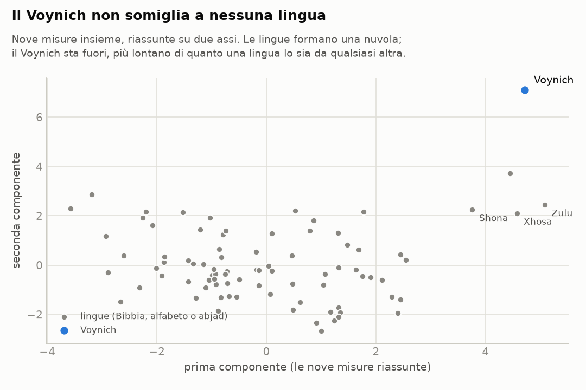
</picture>

**9. Le etichette dello zodiaco non sono numeri.** Ogni segno ha circa 30 ninfe,
come i gradi del segno o i giorni del mese. Ma le etichette sono quasi tutte diverse
(264 su 299), e anche cercando il punto di partenza migliore del cerchio, quelle
nella stessa posizione in segni diversi non si somigliano più di etichette prese a
caso (p = 0,46). Più della metà comincia con *ot-* o *ok-*, e la loro grafia scivola
con regolarità dai Pesci al Sagittario (da forme in *-al-* a forme in *-eo-*): la
stessa deriva di stile delle pagine.

**10. Un tentativo di decifrazione, con i controlli: nessuna lingua lo legge.**
Abbiamo costruito un attacco da manuale contro l'ipotesi più semplice rimasta in
piedi dopo la prima tornata:
- ogni segno del Voynich vale una lettera di una lingua nota;
- più segni possono valere la stessa lettera, come nei cifrari omofonici o come le
  forme iniziali e finali di certe scritture;
- gli spazi sono spazi.

Per ognuna di quattordici lingue il programma cerca la chiave che rende le parole
del Voynich più simili a parole di quella lingua, contando i segni in due modi
diversi. Le lingue: latino, italiano, tedesco, inglese, francese, spagnolo, ceco,
ungherese, greco, ebraico, arabo, turco, e due lingue lontane che per profilo gli
stanno meno distanti (malgascio e chinanteco; il potawatomi, terzo, è rimasto fuori
perché il testo disponibile è troppo corto).
- **Il metodo funziona.** Su un altro pezzo della stessa Bibbia, cifrato con una
  chiave casuale dello stesso tipo, ritrova il testo: 69–98% di
  parole vere, e da 629 a 5.669 parole diverse ("quid mihi et tibi est
  vade ad prophetas…").
- **Sul Voynich no.** In nessuna lingua escono più del 36% di parole vere, e
  mai più di qualche decina di parole diverse (da 7 a 93), in
  buona parte sempre le stesse tre. È quello che succede quando si "decifra" un testo
  scritto in un'altra lingua: da 4 a 86 parole diverse.
- **L'ordine delle parole non aiuta.** Le coppie di parole vicine decifrate non
  esistono nella lingua più delle stesse parole rimescolate. L'eccezione apparente,
  il tedesco, viene da una chiave degenere: trasforma le parole più frequenti del
  Voynich in *seien*, *er*, *sie* e ne ricalca le ripetizioni (*er er*, *seien sie*).
  È la struttura del Voynich, non un significato: uno scarto così compare anche in
  4 controlli negativi su 14, dove per costruzione non c'è niente
  da leggere.
- **Lo zodiaco non conferma niente.** Nelle sei lingue per cui abbiamo i nomi di mesi
  e segni, un nome giusto compare in 3 pagine su 144 (12 pagine, 6 lingue,
  2 modi di contare i segni). Nomi di altri mesi o segni compaiono fuori posto
  22 volte: puro caso.
- **Un controllo in più.** Lo stesso attacco sul Plinio cifrato col Naibbe, che è
  latino vero ma cifrato con un meccanismo diverso, dà 9% di parole vere e
  53 parole diverse: anche un testo che ha senso, se non è cifrato nel modo
  che l'attacco presuppone, gli sembra vuoto.

Questo esclude una cosa precisa: che il Voynich sia una sostituzione, anche
omofonica, di una di queste lingue con gli spazi al loro posto. Non esclude
cifrari più complessi (il Naibbe stesso, codici, trasposizioni, lettere nulle), né
le lingue non provate. Senza gli spazi (esperimento 16) il nostro attacco non
rompe nemmeno i controlli: lì non possiamo dire niente.

<picture>
  <source media="(prefers-color-scheme: dark)" srcset="risultati/e14_decifrazione-scuro.png">
  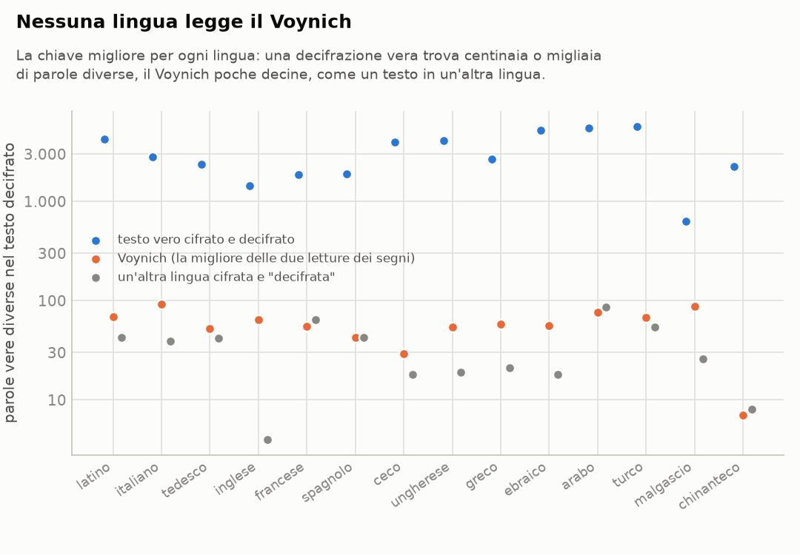
</picture>

## Terza tornata: un risolutore vero, e altre strade

**11. Un risolutore che funziona anche senza spazi.** Nella seconda tornata l'attacco
senza spazi non rompeva nemmeno i controlli. Adesso c'è un risolutore costruito come
quelli che si usano sui cifrari omofonici veri, per esempio quelli dello Zodiac
([analisi/ricottura.py](analisi/ricottura.py)):
- **come cerca:** parte da una chiave a caso e la cambia un segno alla volta, per
  decine o centinaia di migliaia di passi. Ogni tanto accetta anche un cambio che
  peggiora, sempre più di rado (ricottura simulata): così la ricerca non resta
  incastrata nella prima chiave discreta;
- **come giudica:** con la probabilità del testo decifrato secondo un modello della
  lingua fatto di gruppi di cinque lettere, senza spazi. Per il latino il modello
  impara da circa 9 milioni di lettere: la Bibbia più la Latin Library, tolti i testi
  usati come prova;
- **l'accorgimento decisivo:** conta anche quanto sono varie le lettere decifrate.
  Senza, la ricerca finisce in chiavi degeneri che usano cinque o sei lettere
  frequenti ("etetitis…"). Non è un trucco: è la probabilità di aver scelto proprio
  quei segni per quelle lettere.

Sui testi di prova ritrova la chiave: dal 98% al 100% nelle Bibbie in quattordici
lingue, con 26–74 segni diversi, e il 100% in due testi latini che non sono la Bibbia
(Varrone sull'agricoltura, Isidoro sulle piante). Un testo finlandese attaccato come
se fosse in un'altra lingua resta illeggibile, come deve.

**12. Senza spazi, il Voynich non si legge in nessuna delle quattordici lingue,
comunque si contino i segni.** Le lingue sono quelle della seconda tornata. Ogni riga
del Voynich è presa come una sequenza continua, e l'ipotesi è che ogni unità valga
una lettera (più unità possono valere la stessa). Le unità si contano in quattro
modi:
- i segni EVA (26 segni diversi);
- i segni di Glen Claston (alfabeto v101, 59);
- gruppi di segni imparati dal testo, a due gradi (45 e 74 gruppi diversi). È la
  versione "tokenizzata": *aiin*, *ol*, *dy*, *qok*, *chedy* diventano ciascuno una
  lettera.

Le parole intere come lettere non le abbiamo provate: con 8.000 parole diverse
servirebbero centinaia di segni per ogni lettera, e la forma realistica di questa
idea, il Naibbe, è già stata messa alla prova (punto 6).

I gruppi si imparano fondendo via via, dentro le parole, le due unità vicine più
legate fra loro. Su un cifrario verboso fatto apposta (ogni lettera diventa uno o due
gruppi di 1–3 segni EVA) questo metodo ritrova tutti i 35 gruppi veri, e il
risolutore legge il testo: con 50 fusioni le parole vere di almeno sei lettere coprono
il 49% del testo decifrato, contro il 61% del testo in chiaro. Ma solo al grado giusto:
con 20 fusioni, o prendendo i segni uno per uno, si resta al 3–7%. Il metodo più
diffuso (byte-pair encoding), che guarda solo quanto spesso due unità stanno insieme,
ritrovava 27 gruppi su 35 e ne incollava di diversi.

Per ogni lingua e ogni modo di contare, i controlli hanno lo stesso numero di simboli
e la stessa lunghezza del Voynich letto in quel modo.
- **Il risolutore funziona:** nei 56 controlli positivi (14 lingue per 4 modi) ritrova
  almeno il 99,9% della chiave, tranne uno che si ferma al 98%: il chinanteco, che ha
  più lettere (30) di quanti segni EVA abbia il Voynich (26).
- **Sul Voynich no.** Mettiamo a 0 il punteggio del controllo negativo (un'altra
  lingua cifrata allo stesso modo) e a 1 quello del positivo: il Voynich sta fra
  −0,6 e 0,4, sotto lo 0 in 30 casi su 56. Nel testo decifrato le parole vere di
  almeno sei lettere coprono fra lo 0,3% e il 10% delle lettere. Nei controlli
  negativi si va dallo 0,5% al 9%, nei positivi dal 16% al 61%.
- **Il testo "decifrato" è una poltiglia di sillabe della lingua:** in latino
  *lusacarutusunummodetdesacsicaresdetta*, in italiano
  *taoisitanaramaggioanoaridresitaroandi*, in tedesco
  *saieheranabaralleieniebegbsherebiente*. Il cifrario verboso di prova, invece,
  diventa *…ascendissent venerunt in hierusalem et…*.
- **Il punto più alto, l'ebraico letto a segni EVA (0,42), non regge.** Viene da una
  sola delle quattro ripartenze; le altre tre danno fra 0,09 e 0,22. Il testo
  decifrato è una fila di parolette frequenti ripetute (כי, כל, לא, היא…), con le
  forme finali delle lettere dove non possono stare. E nella prova su tutte le lingue
  (punto 14) il Naibbe, che non è ebraico, arriva dove arriva il Voynich: 0,39 contro
  0,37.

<picture>
  <source media="(prefers-color-scheme: dark)" srcset="risultati/e17_ricottura-scuro.png">
  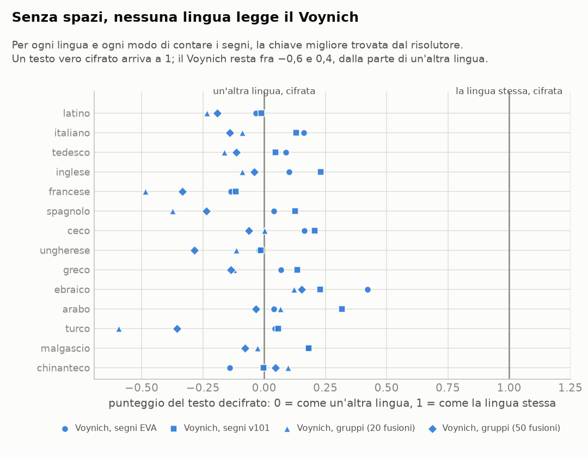
</picture>

**13. Nemmeno a gruppi più corti o più lunghi.** Il cifrario verboso di prova si legge
solo quando i gruppi sono quelli giusti: con 50 fusioni sì, con 20 no. Se il Voynich
fosse un cifrario verboso con gruppi di un'altra misura, due gradi scelti a mano
potrebbero mancarlo. Per questo abbiamo provato nove gradi, da 10 a 150 fusioni (da 36
a 173 gruppi diversi), in latino e in italiano, con i controlli rifatti a ogni grado.
- **I controlli positivi si risolvono tutti**, con il 100% della chiave, anche con
  173 simboli.
- **Il cifrario verboso di prova si legge** fra 30 e 60 fusioni (posizione fra 0,47 e
  0,74), sempre meno allontanandosi da lì.
- **Il Voynich non si legge a nessun grado**: sta fra −0,33 e 0,00, cioè come un testo
  in un'altra lingua, o peggio.

<picture>
  <source media="(prefers-color-scheme: dark)" srcset="risultati/e20_gradi-scuro.png">
  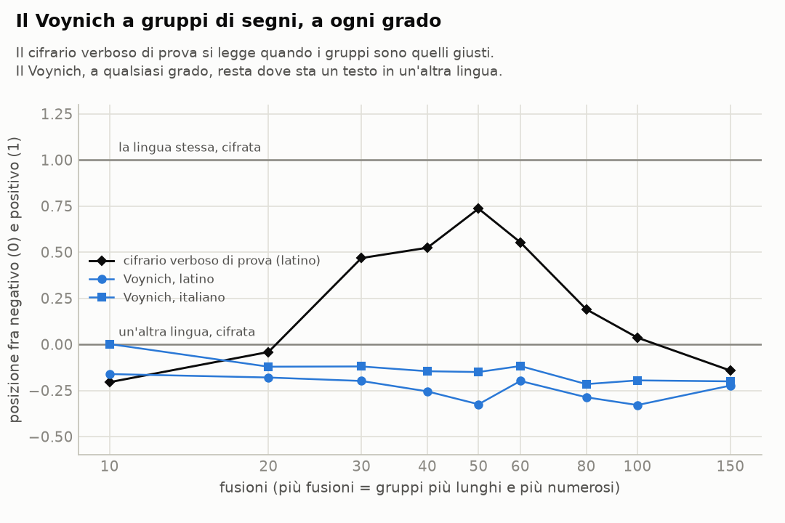
</picture>

**14. Nemmeno in tutte le altre lingue, né leggendo al contrario.** Le quattordici
lingue sono una scelta. Per non lasciarne fuori una inattesa, il risolutore ha provato
tutte le 71 Bibbie del corpus scritte in un alfabeto o in un abjad con al massimo 32
lettere:
- lingue europee, semitiche, turche e uraliche;
- lingue austronesiane, amerindiane e africane;
- il cinese in pinyin.

Il Voynich è letto a segni EVA, una riga su due per stare nei tempi. Lo leggiamo anche
da destra a sinistra, nel caso la scrittura andasse all'indietro.
- **I controlli positivi riescono in tutte le 71 lingue**, con il 91–100% della chiave.
- **Il Voynich non supera 0,47** (shona), e in 66 lingue su 71 resta sotto 0,3.
  Letto al contrario non supera 0,39.
- **Quel poco che sale è grana, non lingua.** Il Naibbe non è una sostituzione di
  nessuna di queste lingue: è latino cifrato in un altro modo. Ha però la grana del
  Voynich (segni prevedibili, parole corte e regolari), e arriva poco sotto, in mediana
  0,09 in meno. Nelle cinque lingue dove il Voynich sale di più:
  - shona: Voynich 0,47, Naibbe 0,33;
  - ebraico: 0,37 e 0,39;
  - rumeno: 0,33 e 0,27;
  - paite: 0,32 e 0,07;
  - persiano: 0,30 e 0,17.
- **Le parole vere di almeno sei lettere** coprono al massimo un quarto di quanto
  coprono in un testo vero cifrato: in mediana l'1,7% del testo decifrato, contro il
  47%.

<picture>
  <source media="(prefers-color-scheme: dark)" srcset="risultati/e19_tutte_le_lingue-scuro.png">
  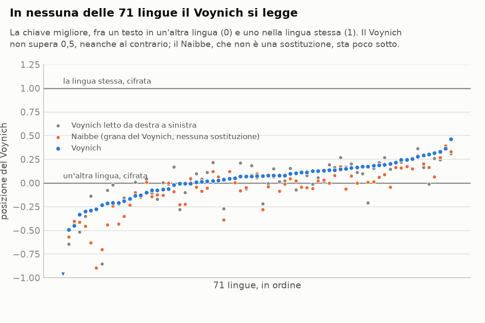
</picture>

**15. Le parole del Voynich non sono anagrammi ordinati.** Un'idea che torna spesso
(Hauer e Kondrak, 2016) è che ogni parola sia una parola vera con le lettere rimesse
in un ordine fisso, per esempio alfabetico. Allora un ordine dei segni sarebbe
rispettato da tutte le parole, e non esisterebbero due parole con gli stessi segni in
ordine diverso. Nel Voynich:
- **l'ordine migliore dei segni** è rispettato dal 78,5% delle coppie di segni dentro
  le parole. È un valore da lingua: fra 60% e 96%, mediana 66%, con il vietnamita a
  79% e il cinese in pinyin a 96%. Il latino con le lettere in ordine alfabetico,
  per costruzione, fa 100%;
- **il 35% delle parole ha un anagramma nel testo** (27% contando i segni come Glen
  Claston). Nelle lingue si va dall'1% al 27%, mediana 5%, e il massimo è l'ebraico
  scritto senza vocali. Con le parole ordinate sarebbe 0%. Spesso l'anagramma è una
  variante rara con un pezzo spostato da un capo all'altro (*chol* → *lcho*, *shey*
  → *yshe*, *ol* → *lo*): ricorda la mobilità dei pezzi vista nelle giunture fra
  parole (punto 7).

<picture>
  <source media="(prefers-color-scheme: dark)" srcset="risultati/e18_anagrammi-scuro.png">
  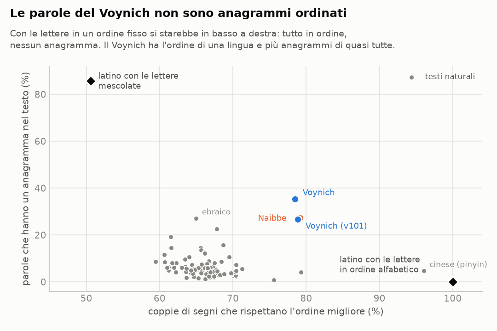
</picture>

## Quarta tornata: sondaggi sulle strade rimaste

Un giro veloce, su campioni di 20.000 parole: per ogni strada rimasta aperta abbiamo
costruito un testo come lo produrrebbe quell'ipotesi, partendo da testi veri, e lo
abbiamo misurato con la lista di controllo. Non è una decifrazione. Serve a vedere
quali strade vanno nella direzione del Voynich
([tabella completa](risultati/e21_sondaggi.md)). Nel Voynich:
- h2 vale 2,2 (il latino 3,3);
- lo spazio è prevedibile al 66% (il latino al 19%);
- una parola ripete la precedente ×1,0 (il latino ×0,18);
- la somiglianza fra parole della stessa riga è del 3,8% (il latino 0,2%).

**16. Abbreviazioni: la direzione sbagliata.** Il latino scritto con le abbreviazioni
dei manoscritti (*-us*, *-um*, *-rum*, *-que*, *per*, *con*, le vocali nasali con la
tilde…) diventa meno prevedibile, non di più: h2 sale da 3,26 a 3,37. Chi abbrevia
toglie proprio le parti più prevedibili. Lo spazio diventa un po' più prevedibile (32%),
perché le abbreviazioni finali stanno solo in fondo alle parole. Ripetizioni e somiglianze
restano quelle del latino. Estendere il risolutore a segni che valgono più lettere
quindi promette poco: da sola, questa strada allontana dal Voynich.

**17. Lettere nulle: a metà strada, se messe a regola.** Nulle sparse a caso allontanano
dal Voynich (h2 3,54, vocabolario gonfiato). Nulle messe con una regola fissa, in testa
alle parole che cominciano per vocale e in coda a quelle che finiscono per vocale,
avvicinano h2 (2,94) e la prevedibilità dello spazio (53%). Ripetizioni e somiglianze,
però, non cambiano.

**18. Trasposizioni: no.** Rimescolare le lettere, con una trasposizione a colonne o
dentro le parole, porta h2 a 3,9 e rende le parole casuali. Capovolgere le parole non
cambia niente. Ordinarne le lettere avvicina h2 (2,5), ma è l'ipotesi degli anagrammi,
già esclusa (punto 15).

**19. Testi a elenco, anche cifrati con un codice: non bastano.** Abbiamo provato tre
elenchi veri in latino:
- le genealogie e i censimenti della Bibbia;
- la Notitia Dignitatum, un elenco di cariche;
- i Fasti di Idazio, un elenco di consoli.

Ripetono la parola precedente ancora meno della prosa (×0,00–0,07), e la somiglianza
nella riga arriva al massimo all'1,6%. Cifrati con un codice parola per parola prendono la
grana del Voynich (h2 1,9–2,2, spazio 69–75%). Ma non le sue anomalie: ripetizioni
×0,00–0,07, somiglianza nella riga intorno a 0. Almeno questo tipo di contenuto non spiega
il Voynich. Altri tipi (litanie, formule magiche, tavole) restano da provare.

**20. Nessun messaggio: l'unica strada che produce le anomalie.** Abbiamo provato
due varianti veloci dell'autocitazione di Timm e Schinner: ogni parola è una copia
ritoccata di una parola delle righe sopra. Entrambe fanno uscire da sole le due proprietà
più strane del Voynich:
- **le ripetizioni immediate:** ×1,07 e ×1,29;
- **la somiglianza di pagina che cala con la distanza fra le righe:** dal 12% della
  riga al 4% a sei righe, o dal 9% al 6%.

Nessun'altra strada provata ci arriva. Tarare tutto insieme però non è banale. Se le
modifiche seguono la forma delle parole del Voynich, h2 e spazio tornano, ma il
vocabolario collassa su poche parole brevi. Se seguono solo la lunghezza, il vocabolario
regge ma le parole perdono la grammatica del Voynich (h2 3,34, spazio 5%). L'algoritmo
completo degli autori, pensato apposta, è il prossimo passo naturale.

**21. L'algoritmo completo di Timm e Schinner rifà gran parte del Voynich.** Abbiamo
fatto girare il loro generatore così com'è
([TorstenTimm/SelfCitationTextgenerator](https://github.com/TorstenTimm/SelfCitationTextgenerator),
Java, licenza MIT), con i parametri pubblicati. Cambiano solo la lunghezza, 4.000 righe
come il Voynich, e il seme del caso: cinque semi, circa 36.700 parole ciascuno. Il
procedimento è quello descritto sopra, con le regole scritte dagli autori:
- da quali righe copiare, e quanto spesso dalla stessa posizione della riga sopra;
- quali segni si scambiano fra loro;
- quali pezzi si aggiungono o tolgono;
- quando due parole si uniscono o una si divide;
- quali parole frequenti del Voynich "suggerire" quando mancano parole in *-aiin*,
  *-ol* o *-dy*.

Regole e parametri vengono dal Voynich stesso: che il testo generato gli somigli non è
una sorpresa. Conta che un procedimento così semplice, eseguibile a mano, riproduca
proprietà che nessuna lingua e nessun cifrario hanno.

Il risultato, misurato con la lista di controllo
([tabella completa](risultati/e22_timm_schinner.md)):
- **uguale al Voynich:**
  - h2: 2,23–2,26 (Voynich 2,24);
  - somiglianza nella riga: 3,5–3,9% (3,8%);
  - somiglianza a sei righe, che cala come nel Voynich: 3,2–3,5% (3,4%);
- **vicino:**
  - ripetizioni immediate ×0,72–0,78 (Voynich ×1,0, lingue ×0,12);
  - spazio prevedibile 51–57% (66%);
  - anagrammi 42–46% (35%);
- **lontano:**
  - vocabolario meno vario: hapax 52% contro 68%, parole diverse 14% contro 21%;
  - le parole vicine unite danno parole esistenti 1,2 volte più del caso, nel Voynich
    2 volte;
- **mancante:** il legame fra la fine di una parola e l'inizio della successiva. Nel
  Voynich vale 0,19 bit, più che nella lingua tipica (0,07); nel generatore 0,01–0,02,
  come nel Naibbe (0,002). Nel Voynich come comincia una parola dipende da come è
  finita la precedente. Nel generatore quasi no, perché ogni parola è copiata dalle
  righe sopra senza guardare quella appena scritta.

Nessun cifrario provato in questo lavoro si avvicina altrettanto. Non dimostra che il
Voynich sia senza messaggio. Dimostra che un procedimento eseguibile a mano, senza
nessun contenuto, basta a produrre quasi tutte le sue stranezze. E indica che cosa manca
per il resto: le giunture fra parole vicine.

<picture>
  <source media="(prefers-color-scheme: dark)" srcset="risultati/e22_timm_schinner-scuro.png">
  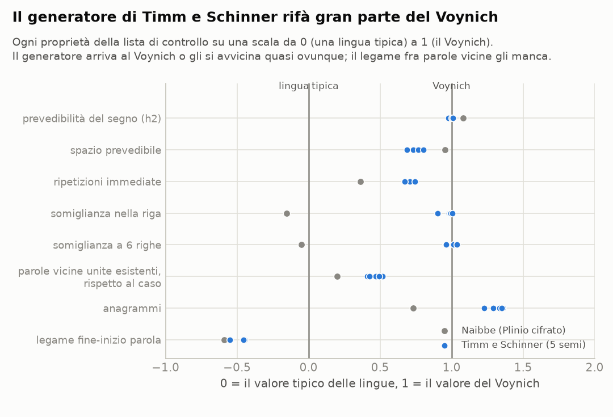
</picture>

**22. Con una regola in più, sulle giunture, il legame fra parole compare.** Al
generatore di Timm e Schinner mancava soprattutto il legame fra parole vicine. Gli
abbiamo aggiunto una regola sola, eseguibile a mano come le altre: quando nella riga c'è
già una parola, lo scriba tiene la copia ritoccata con una probabilità che dipende da
come la sua prima lettera si attacca all'ultima della parola precedente. Le preferenze
vengono dal Voynich, come tutte le regole del generatore: dopo *-y* volentieri *q-*,
dopo *-r* volentieri *a-*, dopo *-n* quasi mai *k-*. Se la copia non va, lo scriba ne
sceglie un'altra.

Il resto del programma non cambia: senza la regola il testo esce identico a quello del
programma pubblicato, byte per byte ([dettagli](risultati/e23_giunture.md)). Con la
regola a forza 3 (cinque semi):
- **il legame fra parole vicine arriva al Voynich:** 0,175–0,182 bit, contro 0,188
  (senza la regola 0,016);
- **le altre proprietà restano più o meno dove erano:**
  - h2 2,23;
  - ripetizioni ×0,81;
  - somiglianza nella riga 3,2%, a sei righe 3,1%;
  - spazio prevedibile 58%;
- **resta un vuoto, il vocabolario:** le parole usate una volta sola sono il 51%, nel
  Voynich il 68%. Abbiamo provato a cambiare, uno alla volta, sette parametri del
  generatore (suggerimenti, aggiunte e tolte, unioni e divisioni, parole strane…). Il
  valore resta fra il 50% e il 54%. Con i parametri che abbiamo provato, copiare dalle
  righe vicine produce un vocabolario più ripetitivo di quello del Voynich.

<picture>
  <source media="(prefers-color-scheme: dark)" srcset="risultati/e23_giunture-scuro.png">
  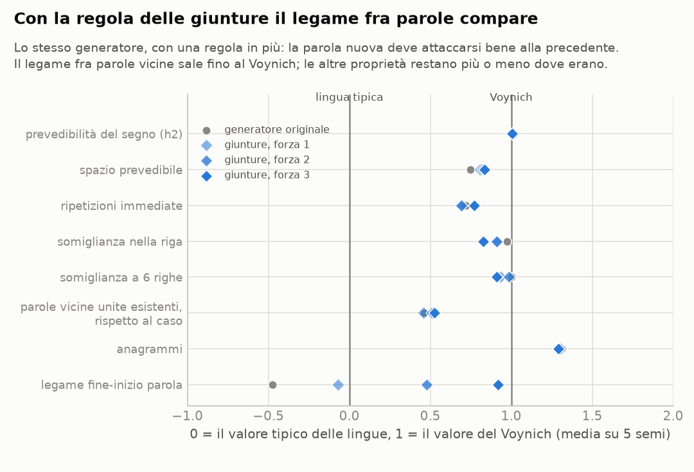
</picture>

**23. Il vocabolario: più parole nuove, meno somiglianza.** Con le giunture al
generatore mancava soprattutto la varietà del vocabolario. Abbiamo provato due regole
in più, eseguibili a mano ([dettagli](risultati/e24_varieta.md)), a varie dosi su un
seme e, per la combinazione migliore, su cinque:
- **il doppio ritocco:** a volte lo scriba ritocca una seconda volta la copia appena
  ritoccata. Le parole usate una volta sola salgono dal 50% fino al 58%, ma la
  somiglianza fra parole della stessa riga scende da 3,4% a 2,9%;
- **la copia da lontano:** a volte la parola da copiare viene dalle pagine già finite.
  Le parole uniche non salgono (51–52%), e la somiglianza crolla (1,0–2,4%): le pagine
  smettono di avere un lessico proprio.

La combinazione più vicina al Voynich (30% di doppi ritocchi, su cinque semi) ha il 54%
di parole uniche, somiglianza 3,2%, ripetizioni ×0,77 e legame fra parole 0,19. Il
Voynich ha il 68% di parole uniche **e** il 3,8% di somiglianza. Nell'autocitazione
provata qui le due cose si escludono: più parole nuove vogliono dire copie più
diverse dalle fonti, quindi pagine meno omogenee. Il Voynich le ha tutte e due, e
nessuna combinazione provata ci arriva. È la differenza più importante rimasta fra il
Voynich e un testo generato così.

<picture>
  <source media="(prefers-color-scheme: dark)" srcset="risultati/e24_varieta-scuro.png">
  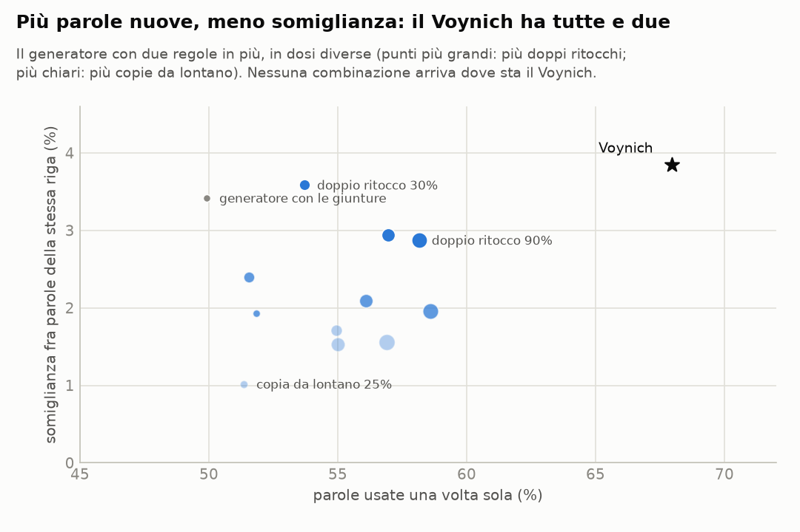
</picture>

**24. Preghiere e litanie: ripetono, ma non come il Voynich.** Se il Voynich fosse un
testo fatto di formule, preghiere ripetute o litanie, le sue ripetizioni verrebbero dal
contenuto. Abbiamo misurato le preghiere più ripetitive del breviario romano in
latino, dal progetto Divinum Officium ([dettagli](risultati/e25_preghiere.md)):
- la litania dei santi ("Sancte Petre, ora pro nobis. Sancte Paule, ora pro nobis…");
- l'ordine della raccomandazione dell'anima, con la litania dei moribondi;
- salmi e cantici con ritornello (il salmo 135, "quoniam in aeternum misericordia
  ejus" a ogni versetto; il cantico dei tre giovani, "Benedicite… Domino");
- le preci del breviario;
- un rosario di quindici decine, ricostruito da Pater noster, Ave Maria e Gloria: il
  caso estremo di una preghiera ripetuta.

Il risultato è netto:
- **nessuna ripete subito la stessa parola:** ×0,00–0,11, contro ×1,0 del Voynich
  (la prosa latina ×0,18). Le preghiere ripetono frasi intere a distanza, non la
  parola appena scritta;
- **niente pagine omogenee:** la somiglianza fra parole della stessa riga è 0,4–1,1%,
  a sei righe intorno a 0;
- **il legame fra parole vicine, invece, c'è, ed è fortissimo:** da 0,09 a 1,37 bit
  (Voynich 0,19), perché "ora pro nobis" torna sempre uguale. Cifrate con un codice
  parola per parola, le preghiere prendono la grana del Voynich (h2 1,76, spazio 82%),
  ma ripetizioni e somiglianze restano quelle delle preghiere.

Preghiere e litanie spiegano quindi il legame fra parole vicine, non le ripetizioni
immediate né le pagine omogenee. La strada del "contenuto che non è prosa" si
indebolisce ancora: né gli elenchi (punto 19) né le preghiere hanno le due proprietà
più strane del Voynich.

## Quinta tornata: le decifrazioni pubblicate, i nomi delle piante, le parole uniche

**25. Due decifrazioni pubblicate leggono anche un testo senza messaggio.** Ogni tanto
qualcuno annuncia di aver letto il Voynich. Due proposte recenti hanno il codice
pubblico, e si possono rifare con i controlli di questo lavoro
([dettagli](risultati/e26_decifrazioni_pubblicate.md)). Il controllo che manca a
entrambe è il testo del generatore di Timm e Schinner (punti 21 e 22): non dice niente,
ma somiglia al Voynich.

*Scott Schechter* legge il Voynich come latino, con qualche parola occitana ed ebraica,
attraverso un glossario di 4.063 parole EVA
([voynich-decoded](https://github.com/scott-schechter/voynich-decoded)). Dichiara di
decifrare l'87,8% delle parole, contro il 2,1% di stringhe EVA a caso. Abbiamo rifatto
in Python il suo programma e i numeri tornano: 89,2% con la versione attuale del
glossario, identici sezione per sezione. Però:
- **la copertura non dice niente.** Le voci del glossario vengono dal testo stesso: un
  "glossario" fatto delle 4.445 parole più frequenti, senza alcun significato, copre il
  90,8%. Delle 4.445 parole diverse che il suo glossario legge, 2.067 compaiono una volta
  sola nel manoscritto. Il confronto con stringhe a caso non misura niente, perché parole
  inventate non stanno nel testo;
- **il glossario legge anche il testo senza messaggio**, al 67–70%;
- **la prova sulle pagine lasciate fuori** (79–81%) è la semplice quota di parole di una
  metà del manoscritto che compaiono già nell'altra (82–83%). Il testo senza messaggio
  ne ha anche di più (85–88%);
- **l'ordine delle parole non è latino.** Nel latino vero (Apicio e Isidoro sulle
  piante) il 30% delle coppie di parole vicine compare anche altrove nel latino; con le
  stesse parole rimescolate dentro la riga, il 22% (×1,34). Nel Voynich decifrato le
  coppie attestate sono l'8,8%, e rimescolate restano l'8,8% (×0,99). È quello che danno
  il testo senza messaggio decifrato (×0,94–0,98) e il glossario con i significati spostati
  a caso fra le voci (×1,01);
- **le frasi ripetute e la legge di Zipf non sono un segno di latino.** Il testo senza
  messaggio, decifrato allo stesso modo, ha più frasi di tre parole ripetute del Voynich
  decifrato (77–112 contro 57), e anche lì molte più che con le parole rimescolate. Non
  decifrato, ha lo stesso esponente di Zipf del Voynich (circa −1).

*Antenore Gatta* ([voynich-toolkit](https://github.com/antenore/voynich-toolkit)) fa
corrispondere a ogni segno EVA una consonante ebraica e legge da destra a sinistra. Lui
stesso conclude che nessuna pagina si legge, ma vede un segnale: con la sua
corrispondenza, più parole di 3–4 consonanti diventano parole ebraiche che con
corrispondenze a caso. Contando come parole ebraiche le forme della Bibbia in ebraico,
il segnale c'è anche qui (35% contro il 12,5% a caso, z = 4,4). Però:
- sul testo senza messaggio la stessa corrispondenza dà il 30% (z = 2,7);
- una corrispondenza cercata apposta per ciascun testo, con una breve ricerca automatica,
  dà il 53% sul Voynich e il 50–61% sul testo senza messaggio: più della sua.

Le parole lunghe (5 consonanti o più) vanno meglio sul Voynich che sul testo senza
messaggio: 3,1% contro 1,4–1,6%. Ma il 69% dei casi viene da due parole sole, *okaiin* e
*okain*.

In breve: le due proposte trovano nel Voynich quello che si trova anche in un testo
senza messaggio. Altre letture annunciate negli ultimi anni, come quella in una lingua
"proto-romanza" di Cheshire (2019) o quella in turco antico di Ardıç, non le abbiamo
provate: non abbiamo trovato un programma o un glossario pubblico che le applichi al testo
intero. Appena ci sono, si provano allo stesso modo.

**26. I nomi delle piante come cartigli: nella prima parola non ci sono.** Se una pagina
dell'erbario parla della pianta disegnata, il suo nome potrebbe stare nel testo: nella
prima parola, come in molti erbari, o almeno nella prima riga. È l'idea con cui Champollion
lesse i cartigli di Tolomeo e Cleopatra ([dettagli](risultati/e27_cartigli.md)).

Le identificazioni delle piante, da qui, non si raggiungono alla fonte: voynich.nu,
HerbalGram, i blog di botanica voynichiana, l'articolo di Bax e le scansioni della Beinecke
sono bloccati. L'unico elenco raggiungibile è quello del toolkit di Gatta: 58 fogli, di cui
15 con identificazioni "universali", "forti" o di Bax e gli altri "moderate", alcune poco
credibili. I nomi latini li abbiamo aggiunti noi.

La prova non presuppone né una lingua né un cifrario preciso. Un modello di allineamento,
come quelli della traduzione automatica, impara quali segni del Voynich "producono" quali
lettere del nome, su tutte le pagine insieme. Se i nomi sono scritti nelle pagine in modo
coerente, gli abbinamenti veri si spiegano meglio di quelli rimescolati fra i fogli.
- **Il controllo positivo si ritrova.** Se al posto della prima parola mettiamo il nome
  cifrato con un cifrario verboso casuale, la prova lo trova sempre (p = 0,001). Con un segno
  su cinque sbagliato lo trova ancora su tutti i fogli, e sui 15 migliori in italiano. Nella
  prima riga intera la prova è più debole: sui 15 fogli migliori ritrova il nome solo in latino
  e senza errori.
- **Nel Voynich non si trova niente**, né in italiano né in latino, né nella prima parola né
  nella prima riga. Il risultato migliore, p = 0,053, è quello che ci si aspetta dal caso su
  otto prove.

Se queste identificazioni sono giuste, la prima parola delle pagine non contiene il nome della
pianta scritto lettera per lettera in italiano o in latino, nemmeno con un cifrario verboso.
La prova resta pronta: con un elenco di identificazioni più affidabile, o con le immagini, si
rifà in pochi minuti.

**27. Le parole uniche hanno l'aria di errori di scrittura o di lettura, ma aggiungere errori
al generatore non basta.** Al generatore di Timm e Schinner manca soprattutto la varietà del
vocabolario: il 50% di parole uniche, contro il 68% del Voynich. I ritocchi fra segni simili
(*k*/*t*, *ol*/*or*, *ch*/*sh*…) sono già il cuore del generatore. Resta un'altra idea: una parte
delle parole uniche non viene dal testo, ma da come è stato scritto o letto. Una *a* chiusa
male sembra una *o*, una *r* sembra una *s*. Un errore così crea una parola nuova che nessuno
copia dopo, cioè proprio una parola unica ([dettagli](risultati/e28_letture.md)).
- **Quanto è incerta la lettura.** Le trascrizioni di Zandbergen-Landini e di Takahashi leggono
  allo stesso modo l'87,5% delle parole, il 5,1% in modo diverso (soprattutto *a*/*o*, *r*/*s*,
  *k*/*t*, *ch*/*sh*) e il 7,4% con spazi diversi.
- **Le parole uniche sono le più incerte:** Takahashi ne legge diversamente il 15,5%, contro il
  4,1% delle altre. Prendendo la sua lettura quando dà una parola già nota, però, le parole uniche
  scendono appena, dal 68% al 66%; e con la trascrizione di Takahashi il Voynich ne ha comunque
  il 68%.
- **Errori aggiunti al testo senza messaggio.** Aggiungiamo al generatore errori come quelli fra
  le due trascrizioni: scambi di un segno con le frequenze osservate, parole unite o divise. Con
  la stessa dose le parole uniche salgono dal 50% al 60–61%; col doppio al 64–65%, e le parole
  diverse arrivano al 20–21%, come nel Voynich. La somiglianza fra parole della stessa riga cambia
  poco (3,0–3,2% contro 3,4%).
- **Le parole uniche del Voynich sono irregolari quanto quelle nate da errori.** Misuriamo quanto
  una parola rispetta le abitudini delle parole ripetute dello stesso testo, in bit per segno:
  le parole uniche del Voynich costano 3,38 bit per segno, quelle del generatore 3,06–3,10,
  quelle del generatore con errori (alla dose osservata o doppia) 3,35–3,42.
- **Ma gli errori guastano il resto:** segni e spazi diventano meno prevedibili. Col doppio
  degli errori h2 passa da 2,21–2,29 a 2,37–2,45 (Voynich 2,24), lo spazio spiegato dal 58–60%
  al 50–52% (Voynich 66%). Senza errori di spazio gli spazi reggono un po' meglio (55–57%), ma
  le parole uniche salgono meno (58–62%), h2 sale lo stesso e il legame fra parole vicine si
  indebolisce (0,150–0,164, Voynich 0,188).

Quindi errori di scrittura o di lettura possono spiegare una parte delle parole uniche, e le
parole uniche del Voynich ne hanno proprio l'aria. Aggiunti a questo generatore, però, lo
rendono meno regolare del Voynich. Servirebbe un generatore più regolare in partenza, che con
gli errori arrivi dove sta il Voynich.

## La lista di controllo

Chi propone una decifrazione, un cifrario o un meccanismo che generi il testo deve
riprodurre tutte queste proprietà insieme, misurate come qui (testo in paragrafi
della trascrizione ZL, segni composti fusi). Accanto, i valori dei testi naturali
(la Bibbia in circa 90 lingue in alfabeto o abjad, più otto testi tecnici latini)
e del cifrario Naibbe. Nelle ultime due colonne il generatore di Timm e Schinner (punto
21) e lo stesso con la regola delle giunture a forza 3 (punto 22): ✓ uguale, ≈ vicino,
✗ lontano.

| proprietà | Voynich | testi naturali | Naibbe | Timm e Schinner | con le giunture |
|---|---|---|---|---|---|
| incertezza sul segno successivo (h2) | 2,22 bit | 2,6–3,3 a parità di alfabeto | 2,2 ✓ | 2,24 ✓ | 2,23 ✓ |
| spazio prevedibile dal segno precedente | 66% | 6–100%, mediana 17% | 64% ✓ | 54% ≈ | 58% ≈ |
| parole diverse ogni 30.000 | 21% | 3–33% | 17–18% ✓ | 14% ≈ | 14% ≈ |
| parole usate una volta sola (hapax) | 68% | 12–72% | 37–44% ✗ | 52% ✗ | 51% ✗ |
| parola identica alla precedente, rispetto alla riga | ×1,0 | ×0,01–1,9, mediana ×0,12 | ×0,33–0,69 ✗ | ×0,76 ≈ | ×0,81 ≈ |
| somiglianza fra parole della stessa riga | 3,8% | da −0,4% a 1,5% | 0–2,2% ✗ | 3,8% ✓ | 3,2% ≈ |
| la stessa somiglianza a 6 righe di distanza | 3,4% (cala) | vicino a 0 | piatta ✗ | 3,4% (cala) ✓ | 3,1% (cala) ✓ |
| legame fine parola → inizio parola seguente | 0,19 bit | 0,02–0,40, mediana 0,07 | 0,002–0,013 ✗ | 0,016 ✗ | 0,178 ✓ |
| due parole vicine unite danno una parola esistente | 9,2% (caso 4,8%) | 0,1–0,7%, pari al caso (4 testi) | 1,0% (caso 1,3%) ✗ | 13,9% (caso 11,7%) ≈ | 11,8% (caso 9,2%) ≈ |

Nessun testo naturale e nessun testo artificiale provato fin qui le ha tutte. Il
generatore di Timm e Schinner con la regola delle giunture ci va più vicino di tutti:
gli manca soprattutto un vocabolario vario quanto quello del Voynich, e le regole
provate per darglielo gli tolgono la somiglianza di pagina (punto 23). Preghiere e
litanie non ripetono le parole come il Voynich (punto 24).

## Che cosa vuol dire per l'ipotesi "tokenizzata"

Metà dell'idea regge e metà no.

Regge che il Voynich **non è una lingua scritta con un alfabeto normale**: i suoi
segni si combinano come i pezzi di un sistema, non come lettere, e contandoli a
gruppi più grandi il testo si avvicina alle lingue. In questo senso stretto,
"tokenizzato" è una buona descrizione.

Non regge la versione più naturale dell'idea, cioè che **ogni parola del Voynich
stia al posto di una parola di un testo in prosa**, attraverso un codice, un
cifrario verboso, delle sillabe o delle varianti. Tutte queste codifiche
conservano il modo in cui una lingua mette in fila le parole, e il Voynich non le
mette in fila così.

La seconda tornata toglie di mezzo anche la versione più sofisticata oggi sul
tavolo, il cifrario Naibbe, in cui ogni parola vale una o due lettere; e un
attacco da manuale, che rompe senza fatica testi veri cifrati allo stesso modo,
non legge il Voynich in nessuna delle quattordici lingue provate. La terza chiude
anche il caso in cui gli spazi non contano: un risolutore che rompe tutti i
controlli, compreso un cifrario verboso fatto apposta, non trova un testo né
prendendo come lettere i segni né prendendo come lettere i gruppi di segni, in
nessuna delle 71 lingue provate. E le parole non sono anagrammi ordinati.

Uno studio uscito nell'agosto 2026, [*A Glyph Is Not a Letter, a Token Is Not a Word,
a Space Is Not a Space*](https://arxiv.org/abs/2608.17096), arriva per altra via a
conclusioni molto vicine. Dal riassunto (il testo intero da qui non si raggiunge):
- i segni del Voynich non si comportano come lettere, le stringhe fra gli spazi
  non come parole, gli spazi non come separatori di parole;
- l'ordine del testo sta ai bordi delle stringhe e nei confini "graduati" fra una e
  l'altra, non nella loro successione;
- la regolarità dei segni è troppo forte per una sostituzione uno a uno.

Sono le stesse cose che troviamo qui con le giunture morbide e dure, il legame
fine-inizio e l'assenza di una struttura da frase.

Restano tre possibilità, che questi esperimenti non sanno ancora distinguere:

1. **un contenuto che non è prosa**: elenchi, tabelle, cataloghi, formule, dove
   ripetere subito una voce è normale e ogni pagina ha il suo lessico, scritti con
   un sistema a unità più grandi delle lettere;
2. **una scrittura le cui convenzioni cambiano da pagina a pagina** e i cui spazi
   non separano parole del testo in chiaro. Un codice "con stile di pagina" riproduce
   l'omogeneità delle pagine, ma non le ripetizioni né la gradazione fra righe vicine;
3. **nessun messaggio**: un testo prodotto da una procedura, per esempio copiando e
   variando quello che si è appena scritto.

Qualunque sia la risposta, deve riprodurre tutte insieme le proprietà della lista
di controllo qui sopra. Nessuna proposta provata finora ci riesce. Dopo la quarta
tornata la terza possibilità è la più avanti. L'algoritmo di Timm e Schinner, con una
regola in più sulle giunture fra parole, arriva più vicino di qualsiasi cifrario: gli
manca soprattutto la varietà del vocabolario. La quinta tornata non cambia il quadro. Le
due decifrazioni pubblicate che si possono rifare leggono allo stesso modo un testo senza
messaggio. I nomi delle piante non si trovano nelle pagine. Le parole uniche che mancano
al generatore potrebbero in parte essere errori di scrittura o di lettura.

## Cosa fare adesso

- **Testi "a elenco"** come termine di paragone: ricettari fatti di liste,
  cataloghi di stelle, glossari, tavole. Se anche loro non evitano le ripetizioni
  e hanno pagine omogenee, la possibilità 1 si rafforza.
- **Il vocabolario dell'autocitazione.** Con la regola delle giunture (punto 22) al
  generatore manca soprattutto la varietà: le parole usate una volta sola sono il 50%,
  nel Voynich il 68%. Né i suoi parametri né il doppio ritocco o la copia da lontano
  (punto 23) la danno senza togliere la somiglianza di pagina. Errori di scrittura o di
  lettura ne danno una buona parte, e le parole uniche del Voynich ne hanno l'aria
  (punto 27), ma rendono il testo meno prevedibile del Voynich. Il passo successivo è un
  generatore più regolare in partenza (segni e spazi più prevedibili), a cui aggiungere
  gli errori.
- **Unità che valgono più lettere, o nessuna.** Il risolutore dà a ogni unità una
  lettera sola. Un segno che vale una sillaba o una desinenza, come le abbreviazioni
  dei manoscritti latini (*-us*, *-rum*, *per*), o un segno che non vale niente,
  richiedono un modello in cui un'unità può valere zero, una o più lettere. I sondaggi
  (punti 16 e 17) dicono che le abbreviazioni da sole allontanano dal Voynich e le nulle
  a regola lo avvicinano solo in parte: è un'estensione possibile, ma non la prima.
- **Trasposizioni**: un testo rimescolato con una regola fissa dentro la riga o la
  pagina non si legge con questo risolutore.
- **Cifrari con "stile di pagina"**: varianti del Naibbe in cui le giunture fra
  parole sono morbide e lo stile cambia gradualmente, riga dopo riga. Sono le due
  cose che il Naibbe non ha.
- **Le immagini e le identificazioni delle piante.** Le scansioni della Beinecke e gli
  elenchi di identificazioni pubblicati da questo ambiente non si raggiungono. La prova dei
  cartigli (punto 26) è pronta: con un elenco affidabile (foglio, pianta) si rifà subito, e
  con le immagini si possono aggiungere le etichette accanto ai disegni.
- **Letteratura recente.** Da questo ambiente arXiv non si raggiunge: lo studio citato
  sopra va letto per intero e confrontato numero per numero con questi risultati.
- **La posizione nella riga e nel paragrafo**: la prima e l'ultima parola di ogni
  riga del Voynich hanno statistiche proprie, e vanno studiate a parte.

## Gli esperimenti

| # | domanda | risultato | dettagli |
|---|---|---|---|
| 1 | La lettera successiva è troppo prevedibile? | Sì a parità di alfabeto; con i segni contati a gruppi (v101) e senza spazi arriva al margine delle lingue | [e01](risultati/e01_prevedibilita.md) |
| 2 | Come si comportano le parole, rispetto a ~100 lingue? | Vocabolario nella norma; ripetizioni e somiglianze fuori norma (da rileggere con 3–5) | [e02](risultati/e02_impronta.md) |
| 3 | Il genere del testo spiega la "poca sintassi"? | Sì: i testi tecnici latini ne hanno altrettanto poca | [e03](risultati/e03_genere.md) |
| 4 | Le parole adiacenti si copiano? | No: è la riga (e la pagina) a essere omogenea | [e04](risultati/e04_vicinato.md) |
| 5 | Quanto dura la somiglianza fra righe? | Tutta la pagina, un po' di più fra righe vicine | [e05](risultati/e05_righe.md) |
| 6 | Gli strumenti ritrovano le lingue A e B di Currier? | Sì, 98,5% delle pagine | [e06](risultati/e06_currier.md) |
| 7 | Un testo vero codificato somiglia al Voynich? | No, con nessuna delle codifiche provate | [e07](risultati/e07_codifiche.md) |
| 8 | Un testo che si copia da solo somiglia al Voynich? | La nostra versione non ci riesce | [e08](risultati/e08_autocitazione.md) |
| 9 | Le due anomalie in un grafico | Il Voynich sta da solo | [e09](risultati/e09_sintesi.md) |
| 10 | Il cifrario Naibbe riproduce il Voynich? | Lettere sì; ripetizioni, pagine, hapax e giunture no | [e10](risultati/e10_naibbe.md) |
| 11 | Gli spazi separano parole? | Lo spazio è per due terzi una regola; il legame fra parole vicine è da lingua con particelle | [e11](risultati/e11_spazi.md) |
| 12 | Quali spazi sono veri? | Giunture morbide e dure; molti spazi incerti non c'erano | [e12](risultati/e12_giunture.md) |
| 13 | A quali lingue somiglia, tutto considerato? | A nessuna: è più isolato di qualsiasi lingua | [e13](risultati/e13_profilo.md) |
| 14 | Una sostituzione omofonica lo legge, in 14 lingue? | No; i controlli positivi invece si leggono | [e14](risultati/e14_decifrazione.md) |
| 15 | Le etichette dello zodiaco sono numeri? | No | [e15](risultati/e15_zodiaco.md) |
| 16 | E ignorando gli spazi? | Non si sa: il metodo non rompe nemmeno il controllo positivo (rifatto nel 17) | [e16](risultati/e16_senza_spazi.md) |
| 17 | Senza spazi, con un risolutore vero, in 14 lingue e 4 modi di contare i segni? | Nessuna lettura; i controlli, anche un cifrario verboso, si leggono | [e17](risultati/e17_ricottura.md) |
| 18 | Le parole sono anagrammi ordinati? | No: ordine da lingua, più anagrammi di quasi tutte le lingue | [e18](risultati/e18_anagrammi.md) |
| 19 | E in tutte le lingue del corpus, anche al contrario? | No: mai oltre 0,47 fra un'altra lingua (0) e la lingua stessa (1), anche al contrario; il Naibbe arriva poco sotto | [e19](risultati/e19_tutte_le_lingue.md) |
| 20 | E con i gruppi di segni a ogni grado? | No, a nessuno dei nove gradi; il cifrario verboso di prova sì, fra 30 e 60 fusioni | [e20](risultati/e20_gradi.md) |
| 21 | Sondaggi: abbreviazioni, nulle, trasposizioni, elenchi, autocitazione | Solo l'autocitazione produce ripetizioni e somiglianza di pagina; le altre no | [e21](risultati/e21_sondaggi.md) |
| 22 | L'algoritmo completo di Timm e Schinner rifà la lista di controllo? | In gran parte sì (h2, somiglianze, quasi le ripetizioni); manca il legame fra parole vicine | [e22](risultati/e22_timm_schinner.md) |
| 23 | E con una regola sulle giunture fra parole? | Il legame compare (0,178 contro 0,188) senza guastare il resto; resta meno vario il vocabolario | [e23](risultati/e23_giunture.md) |
| 24 | Doppio ritocco o copia da lontano danno un vocabolario più vario? | Un po' (fino al 58% di parole uniche), ma a spese della somiglianza di pagina | [e24](risultati/e24_varieta.md) |
| 25 | Preghiere e litanie somigliano al Voynich? | No: niente ripetizioni immediate né pagine omogenee; solo un forte legame fra parole vicine | [e25](risultati/e25_preghiere.md) |
| 26 | Due decifrazioni pubblicate (Schechter in latino, Gatta in ebraico) reggono ai controlli? | No: leggono allo stesso modo un testo senza messaggio, e l'ordine delle parole latine è quello del caso | [e26](risultati/e26_decifrazioni_pubblicate.md) |
| 27 | Il nome della pianta sta nella prima parola o nella prima riga della pagina? | Nessuna traccia, né in italiano né in latino; lo stesso nome cifrato apposta invece si ritrova | [e27](risultati/e27_cartigli.md) |
| 28 | Le parole uniche vengono da errori di scrittura o di lettura? | In parte possono: ne hanno l'aria, ed errori aggiunti al generatore ne alzano il numero (fino al 64–65%), ma lo rendono meno prevedibile del Voynich | [e28](risultati/e28_letture.md) |

## Come rifare tutto

```sh
pip install -r voynich/requirements.txt
python3 voynich/prepara.py                     # scarica e prepara i testi di confronto
python3 voynich/esperimenti/e01_prevedibilita.py
python3 voynich/esperimenti/e02_impronta.py    # e cosi' via fino a e28
python3 voynich/esperimenti/e14_decifrazione.py --naibbe   # il controllo in più dell'esperimento 14
```

Gli esperimenti 17, 19 e 20 fanno girare il risolutore centinaia di volte: con
quattro processori ci vogliono circa due ore il primo e un'ora ciascuno gli altri
due (la variabile `PROCESSI` sceglie quanti processori usare). Con `--tabella` e
`--grafico` rifanno solo tabella e grafico dai risultati salvati. Gli esperimenti 22,
23, 24, 26 e 28 fanno girare il generatore di Timm e Schinner, che è scritto in Java: serve
Java (dal 23 in poi lo ricompilano dal sorgente, con le aggiunte in
`analisi/timm_schinner/`).

Ogni esperimento scrive in `risultati/` un file `.json` con tutti i numeri, una
tabella `.md` e, dove serve, un grafico in versione chiara e scura. I generatori
casuali hanno semi fissi: rifacendo, i numeri tornano uguali.

## Scelte e limiti

- **Trascrizione.** Quella di riferimento è Zandbergen-Landini (versione 3b, maggio
  2025); Takahashi e Glen Claston (alfabeto v101) servono da controllo. Si usa solo
  il testo in paragrafi: etichette, testi in cerchio e raggi restano fuori. Le parole
  con segni illeggibili o rarissimi vengono scartate (lo 0,6%).
- **Segni composti.** Nell'alfabeto EVA alcuni segni del manoscritto sono scritti con
  più lettere (*ch*, *sh*, *cth*, *ckh*, *cph*, *cfh*). Li fondiamo in un segno solo,
  altrimenti il testo sembrerebbe più prevedibile di quanto è.
- **Confronti alla pari.** Ogni misura si confronta su campioni della stessa
  lunghezza, perché molte dipendono dalla lunghezza del campione.
- **La Bibbia come termine di paragone** ha il pregio di avere lo stesso contenuto in
  tutte le lingue e il difetto di essere un genere particolare. Per questo ci sono
  anche i testi tecnici latini, che hanno ribaltato una delle conclusioni.
- **Le immagini non ci sono.** Tutto quello che dipende dai disegni resta fuori.
- **I tentativi di decifrazione** mettono alla prova un modello preciso: ogni unità
  (un segno, o un gruppo di segni) vale una lettera, e più unità possono valere la
  stessa. Con gli spazi al loro posto (esperimento 14) e senza (17, 19, 20). Non
  coprono codici, trasposizioni, lettere nulle, abbreviazioni (un segno per più
  lettere), né le lingue fuori dal corpus. Un esito negativo esclude quel modello
  per quelle lingue, non "ogni decifrazione".
- **I modelli delle lingue** vengono dalla Bibbia, un genere solo; un testo tecnico
  li sorprende di più. Per il latino, dove il modello impara anche dalla Latin
  Library, i controlli su Varrone e Isidoro mostrano che al risolutore basta. Per
  le altre lingue non possiamo verificarlo.
- **L'islandese** nel corpus è segnato per errore come scritto in etiopico, e resta
  fuori dai confronti fra alfabeti.
- **Le fonti** dei dati, con versioni e impronte, sono in [dati/FONTI.md](dati/FONTI.md).

## Glossario

- **EVA**: l'alfabeto convenzionale con cui si trascrive il Voynich in lettere latine
  (*qokeedy*, *daiin*…). Non dice niente sul suono dei segni: è solo un'etichetta.
- **Segno (glifo)**: un carattere del manoscritto. Alcuni si scrivono in EVA con più
  lettere (*ch*, *sh*, *cth*…), e qui li contiamo come uno.
- **h1, h2**: l'incertezza, in bit, su un segno preso da solo (h1) e sul segno
  successivo sapendo quello prima (h2). Più h2 è bassa, più il testo è prevedibile.
- **Hapax**: parola che compare una volta sola.
- **Lingue A e B di Currier**: le due varietà di scrittura in cui si dividono le
  pagine del Voynich, scoperte da Prescott Currier negli anni Settanta.
- **Cifrario omofonico**: ogni lettera si può scrivere con più segni diversi.
- **Cifrario verboso**: ogni lettera si scrive con un gruppo di più segni.
- **Ricottura simulata**: un modo di cercare la soluzione migliore fra moltissime.
  Si cambia una cosa alla volta e ogni tanto si accetta anche un peggioramento,
  sempre più di rado: così non ci si ferma alla prima soluzione discreta.
- **Modello a 5-grammi**: la probabilità di ogni lettera sapendo le quattro prima,
  imparata da un testo lungo nella lingua.
- **Controllo positivo**: un testo di cui si conosce la risposta, trattato come il
  Voynich. Se il metodo non lo risolve, un esito negativo sul Voynich non vale niente.
- **Controllo negativo**: un testo che *non* dovrebbe dare risultati. Dice quanto si
  ottiene per puro caso.
- **p**: la probabilità di ottenere per caso un risultato almeno così forte. Sotto
  0,05 si parla di effetto; sopra, il risultato è compatibile con il caso.
